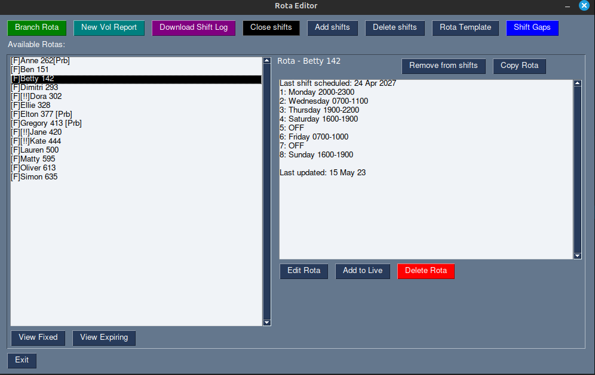
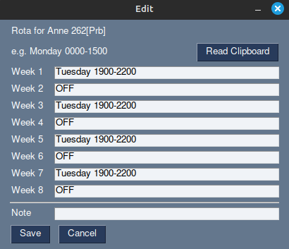
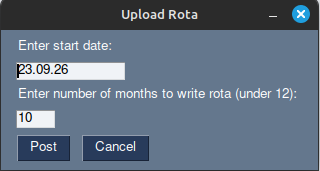
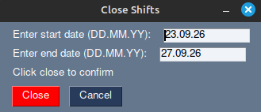
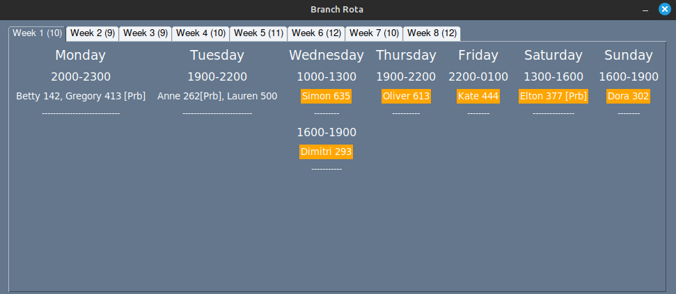

## Demo

See installation instructions at end if you wish to run it yourself.

This is a **demo version of a rota management tool** currently in live use by non-technical users on Windows and Linux. The live project has reduced manual rota management from hours of repetitive clicking to a single automated workflow.

The goal of the project is to **reduce repetitive manual work** and improve oversight by:
- Automating rota management across multiple weeks/months
- Streamlining volunteer assignment
- Generating and distributing regular email reports

Since this demo has no access to the live API or real data, a small dataset is mocked in `vol_rotas.json` to allow the application to function.


### Main Dashboard


Overview of current volunteers. Volunteers have different prefixes, depending on their status, for at-a-glance understanding.
Clicking a volunteer displays their 8-week rota.
"Copy Rota" allows for copying the current rota to clipboard, for correspondence with volunteers.

---

### Editing a Rota


Managers can quickly modify rotas without navigating the external system.
"Read Clipboard" allows pasting an entire rota directly, avoiding manual entry.

---

### Signing up to Shifts


Assign a volunteer for several months of shifts with a given pattern in one action, rather than manually selecting each shift.

A confirmation is requested, including a list of all the shifts that will be allocated, before the action happens.

Output is provided on which shift signups are successful, and which are not (a shift might already be full, or not exist).

---

### Closing Shifts


Bulk close shifts instead of handling them individually.

---

### Branch rota


View how all rotas align across the branch on a weekly basis. Each tab provides an overview of coverage, including the number of volunteers scheduled.

### Emails

The system generates and sends scheduled reports to reduce manual oversight:

**Manager reports**
- Weekly: new joiner activity and status overview - including some action reminders
- Every 8 weeks: shift summary report (per volunteer)
- Every 8 weeks: upcoming DBS expiry alerts
- Quarterly: 6-month shift activity summary

**Volunteer reports**
- Every 8 weeks: individual activity summary.

These reports replace the need to manually check multiple pages for each volunteer, consolidating key information into an automated workflow.

## Installation

1. Install `uv` (if not already installed).
```bash
pip install uv
```
Or see [the official guide.](https://docs.astral.sh/uv/getting-started/installation)

2. Set up environment variables - rename `.env.example` to `.env`
```bash
cp .env.example .env
```

3. Run the application 
```bash
uv run python gui.py
```

### Notes
This is a demo version - API calls are stubbed and no real external systems are modified
No real credentials are required to run the demo
Tested on Linux (should work on other platforms with Python installed)